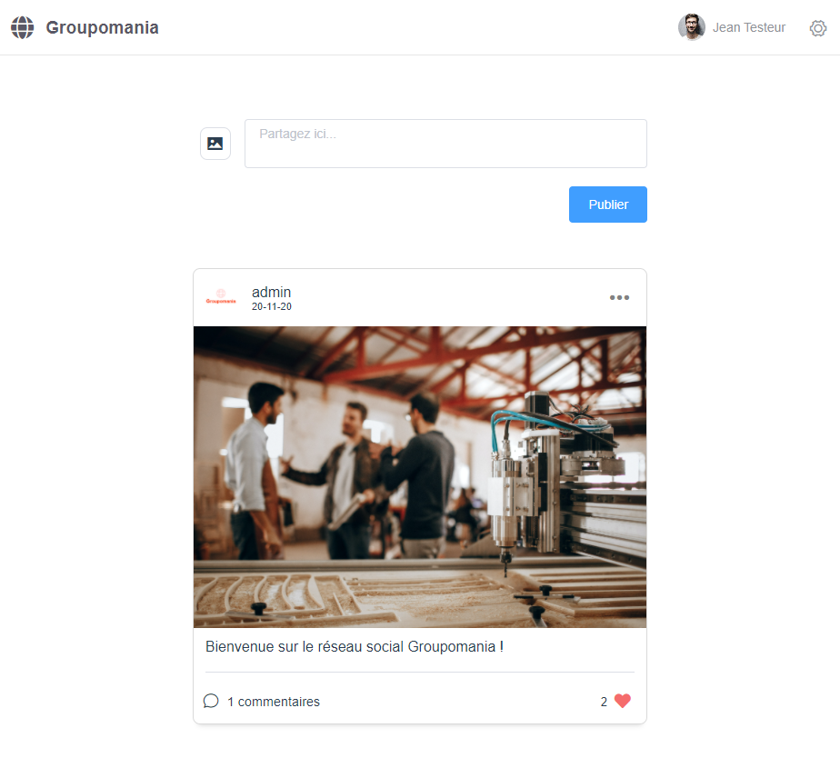

# P7-Groupomania 



## *Environment* 

#### *Backend :* 
Node JS / MySQL / Sequelize

Dependencies :

```
express
bcrypt
body-parser
jsonwebtoken
multer
mysql2
nodemon
sequelize-cli
```

#### *Frontend :* 
Vue JS / Element ui

Dependencies :

```
axios
core-js
element-ui
vue
vue-router
vuex
```

## *Run the project* 

Requires MySQl Workbench (or any mysql manager) and nodeJS installed on your computer.

#### *Backend :*

Edit config.json file inside backend/config
Change the development fields as your database setup(username, password,etc..)

Then on your terminal :

```
cd backend
nodemon run server
```

Tables and rows will be created automatically in your database after run the server.

#### *Frontend :*

Requires VueJS installed globally on your computer.

Then on your terminal :

```
cd frontend
npm run serve
```

The app will run on http://localhost:8080/.

## *Information :*

To setup admin user simply modify 'isAdmin' field to '1' on your database.